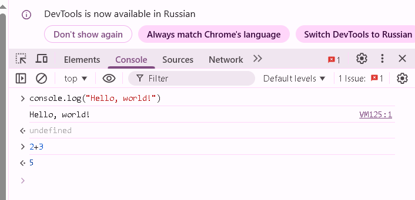
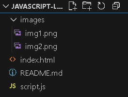
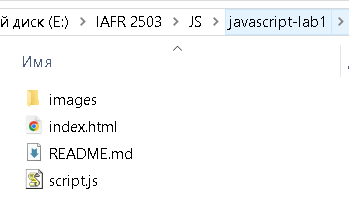
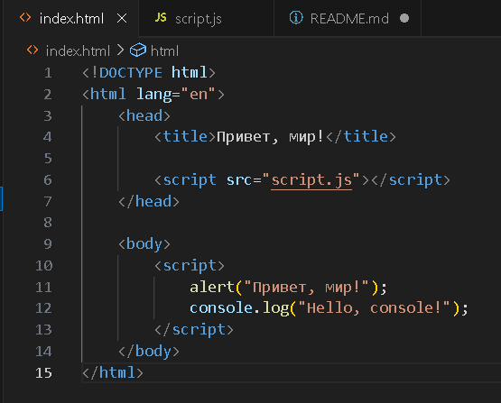
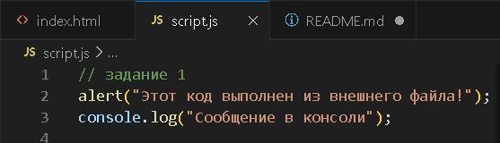
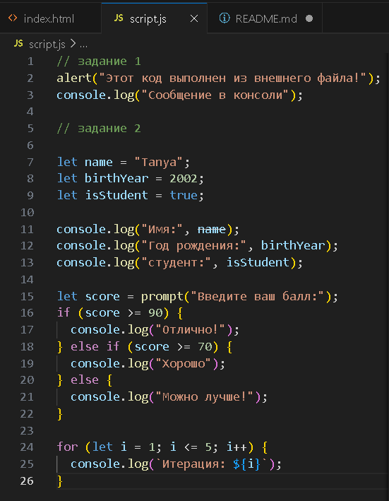

# Лабораторная работа №1

## Цель работы

Познакомиться с основами JavaScript, научиться писать и выполнять код в браузере и в локальной среде, разобраться с базовыми конструкциями языка.

---

## Задание 1. выполнение кода в браузере

В ходе выполнения задания были выполнены следующие действия:

- Установлен Visual Studio Code


- Установлен Node.js
- Изучена работа DevTools в браузере
- Выполнен JavaScript-код в консоли браузера


- Создан HTML-файл с JavaScript-кодом
- Подключён внешний JavaScript-файл



### Код index.html


### Код script.js


## Задание 2. Работа с типами данных

Были созданы переменные разных типов данных:

```javascript
let name = "Tanya";
let birthYear = 2006;
let isStudent = true;
```
Также были изучены:

- условные конструкции if / else
- цикл for
- функция prompt()

### Код


---

## Контрольные вопросы

### 1. Чем отличается var от let и const?

- var имеет функциональную область видимости и может быть переобъявлена.
- let имеет блочную область видимости.
- const используется для констант и не может быть изменена после создания.

### 2. Что такое неявное преобразование типов в JavaScript?

Это автоматическое преобразование одного типа данных в другой JavaScript во время выполнения операций.

Пример:

```javascript
"5" + 2
```

Результат:

```javascript
"52"
```

### 3. Как работает оператор == в сравнении с ===?

- == сравнивает значения с преобразованием типов.
- === сравнивает и значение, и тип данных без преобразования.

Пример:

```javascript
5 == "5"   // true
5 === "5"  // false
```

---

## Вывод

В ходе лабораторной работы были изучены основы JavaScript, работа с переменными, условиями, циклами и подключением JavaScript к HTML.

---

## Использованные источники

- https://developer.mozilla.org/
- https://javascript.info/
- https://nodejs.org/