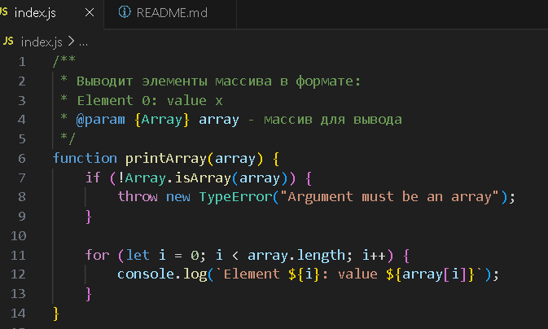
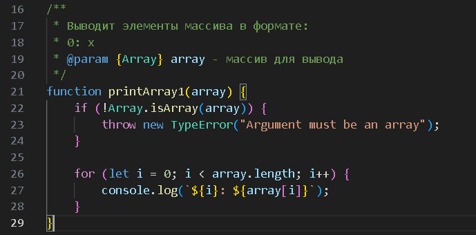
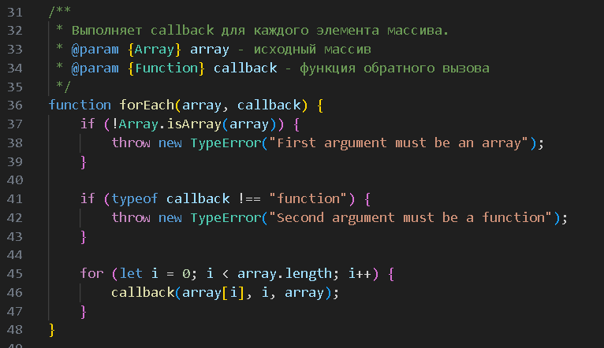
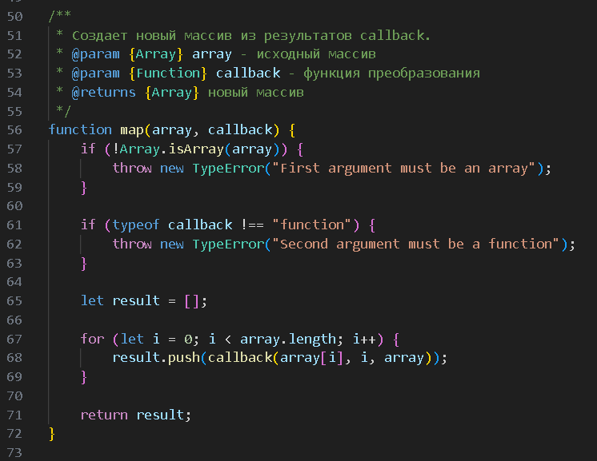
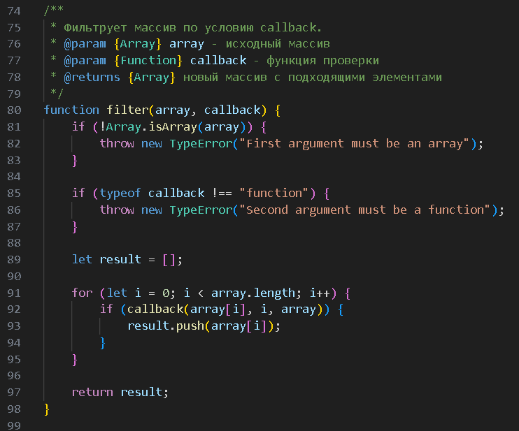
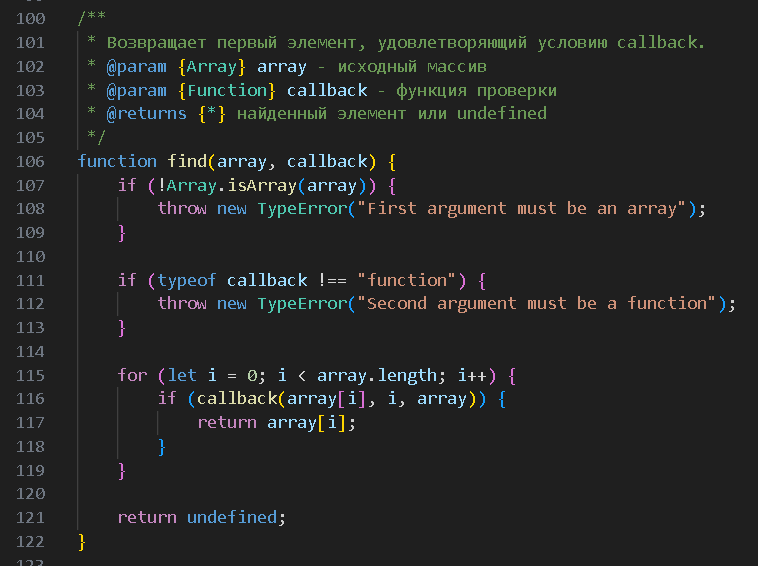
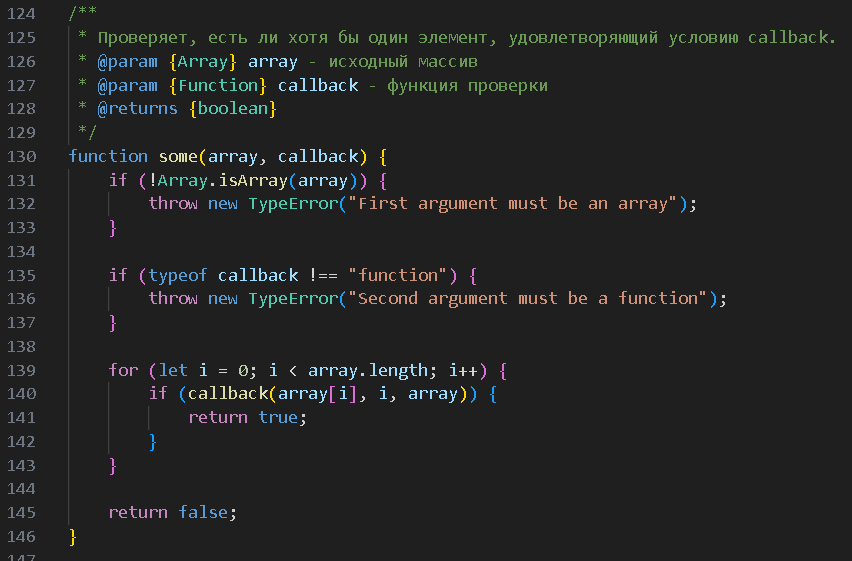
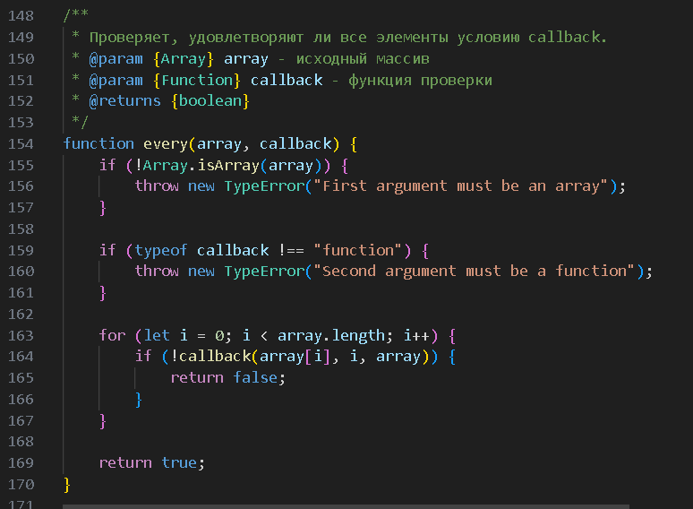
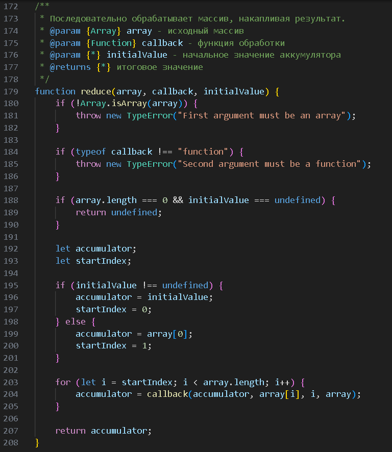

# Лабораторная работа №2
## Реализация базовых методов работы с массивами

---

## Цель работы

Изучить принципы реализации базовых методов работы с массивами с использованием колбэков:

- forEach
- map
- filter
- find
- some
- every
- reduce

без использования встроенных методов массивов JavaScript.

---

## Используемые технологии

- JavaScript
- Node.js
- Visual Studio Code
- GitHub

---

## Реализованные функции

### 1. printArray(array)



Результат:

```text
Element 0: value 1
Element 1: value 2
Element 2: value 3
Element 3: value 4
Element 4: value 5
```

---

### 2. printArray1(array)



Результат:

```text
0: 1
1: 2
2: 3
3: 4
4: 5
```

---

### 3. forEach(array, callback)

Выполняет callback для каждого элемента массива.



Результат:

```text
Index 0: 1
Index 1: 2
Index 2: 3
Index 3: 4
Index 4: 5
```

---

### 4. map(array, callback)

Создает новый массив из результатов callback.



Результат:

```text
[1, 4, 9, 16, 25]
```

---

### 5. filter(array, callback)

Создает массив элементов, удовлетворяющих условию.



Результат:

```text
[2, 4]
```

---

### 6. find(array, callback)

Возвращает первый найденный элемент.



Результат:

```text
2
```

---

### 7. some(array, callback)

Проверяет наличие хотя бы одного элемента, удовлетворяющего условию.



Результат:

```text
true
```

---

### 8. every(array, callback)

Проверяет, удовлетворяют ли все элементы условию.



Результат:

```text
false
```

---

### 9. reduce(array, callback, initialValue)

Последовательно обрабатывает массив и накапливает результат.



Результат:

```text
15
```

---

## Пример запуска программы

```bash
node index.js
```

---

## Контрольные вопросы

### 1. В чем преимущества использования колбэков при работе с массивами?

Колбэки делают код более гибким и универсальным. Одна функция может выполнять разные действия над массивом в зависимости от переданного callback. Это уменьшает дублирование кода, улучшает читаемость программы и упрощает обработку данных. Также колбэки позволяют реализовать функциональный подход к работе с массивами.

### 2. Какие проблемы могут возникать при использовании колбэков и как их избежать?

Основные проблемы:

- передача не функции вместо callback;
- передача не массива;
- отсутствие **return** в **map** или **filter**;
- сложность чтения при большом количестве вложенных колбэков.

Избежать проблем помогают:

- проверка аргументов (**Array.isArray**, **typeof**);
- использование **TypeError**;
- разделение кода на небольшие функции;
- внимательная работа с **return**.

### 3. Как реализовать функции map, filter, find, some, every и reduce без использования встроенных методов массивов?

Все функции реализуются с помощью:

- цикла **for**;
- свойства **length**;
- обращения по индексу;
- метода **push**.

Алгоритм работы:

1. Перебрать массив циклом **for**.
2. Для каждого элемента вызвать callback:

```text
callback(element, index, array)
```

3. В зависимости от функции:
- **map** — сохраняет результат callback;
- **filter** — сохраняет подходящие элементы;
- **find** — возвращает первый найденный элемент;
- **some** — проверяет наличие хотя бы одного совпадения;
- **every** — проверяет все элементы;
- **reduce** — накапливает итоговое значение.

## Вывод

В ходе лабораторной работы были реализованы основные методы работы с массивами без использования встроенных методов JavaScript.

Были изучены:
- работа колбэков;
- перебор массива с помощью цикла *for*;
- создание новых массивов;
- поиск и фильтрация элементов;
- накопление результата с помощью *reduce*.