# Лабораторная работа №3
## Основы работы с массивами, функциями и объектами в JavaScript

---

## Цель работы

Изучить основы работы с:

- массивами;
- объектами;
- функциями;
- методами обработки данных в JavaScript.

Научиться анализировать массив транзакций с помощью различных функций.

---

## Используемые технологии

- JavaScript
- Node.js
- Visual Studio Code
- GitHub

---

# Создание массива транзакций

В проекте был создан массив объектов `transactions`.

Каждая транзакция содержит:

- `transaction_id` - уникальный идентификатор транзакции.
- `transaction_date` - дата транзакции.
- `transaction_amount` - сумма транзакции.
- `transaction_type` - тип транзакции (приход или расход).
- `transaction_description` - описание транзакции.
- `merchant_name` - название магазина или сервиса.
- `card_type` - тип карты (кредитная или дебетовая).

Пример транзакции:

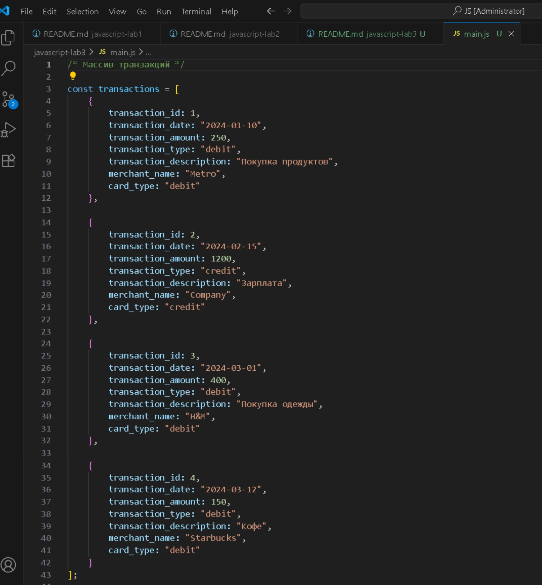

---

# Реализованные функции

## 1. getUniqueTransactionTypes(transactions)

Возвращает уникальные типы транзакций с использованием `Set()`.

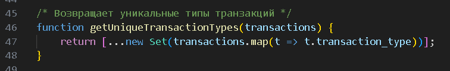

Результат:

```text
[ 'debit', 'credit' ]
```

---

## 2. calculateTotalAmount(transactions)

Вычисляет общую сумму всех транзакций.

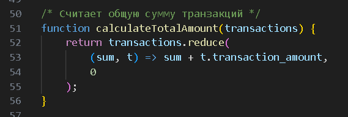

Результат:

```text
2000
```

---

## 3. getTransactionByType(transactions, type)

Возвращает транзакции указанного типа.

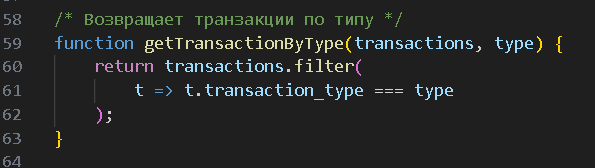

Результат:

```text
Debit транзакции:
[
  {
    transaction_id: 1,
    ...
  }
]
```

---

## 4. getTransactionsInDateRange(transactions, startDate, endDate)

Возвращает транзакции в указанном диапазоне дат.

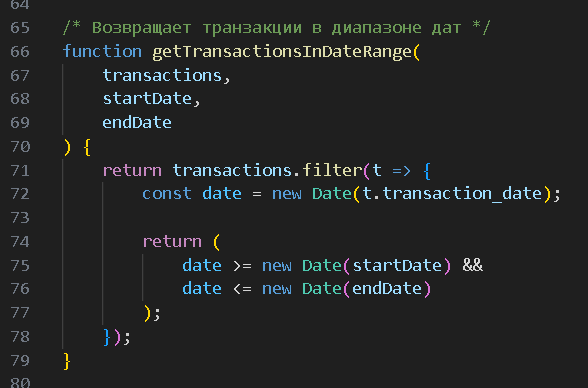

Результат:

```text
Транзакции с 2024-01-01 до 2024-03-01
```

---

## 5. getTransactionsByMerchant(transactions, merchantName)

Возвращает транзакции указанного магазина.

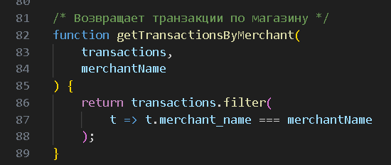

Результат:

```text
Транзакции магазина H&M
```

---

## 6. calculateAverageTransactionAmount(transactions)

Вычисляет среднее значение суммы транзакций.

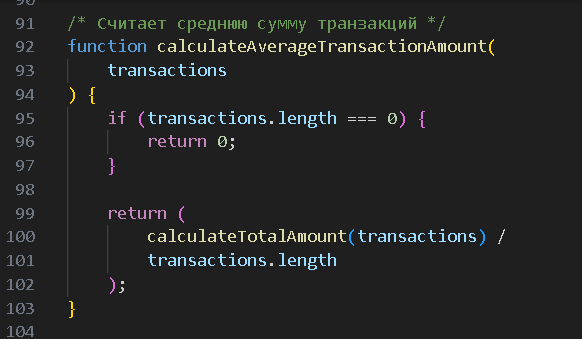

Результат:

```text
500
```

---

## 7. getTransactionsByAmountRange(transactions, minAmount, maxAmount)

Возвращает транзакции в заданном диапазоне сумм.

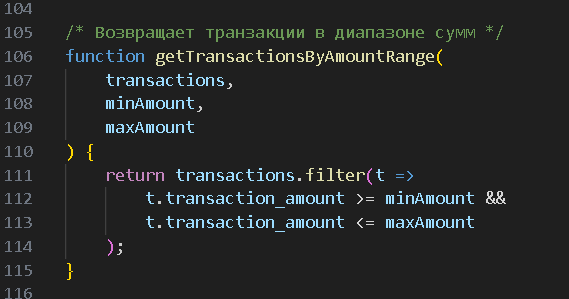

Результат:

```text
Транзакции от 100 до 500
```

---

## 8. calculateTotalDebitAmount(transactions)

Вычисляет общую сумму debit-транзакций.

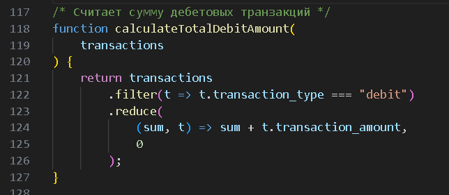

Результат:

```text
800
```

---

## 9. findMostTransactionsMonth(transactions)

Находит месяц с наибольшим количеством транзакций.

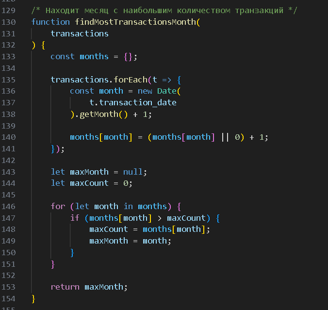

Результат:

```text
3
```

---

## 10. findMostDebitTransactionMonth(transactions)

Находит месяц с наибольшим количеством debit-транзакций.

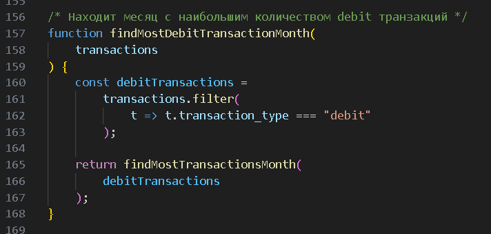

Результат:

```text
3
```

---

## 11. mostTransactionTypes(transactions)

Определяет, каких транзакций больше.

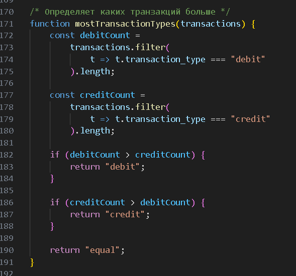

Результат:

```text
debit
```

---

## 12. getTransactionsBeforeDate(transactions, date)

Возвращает транзакции до указанной даты.

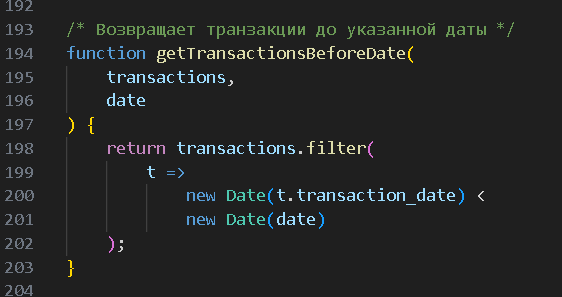

Результат:

```text
Транзакции до 2024-03-01
```

---

## 13. findTransactionById(transactions, id)

Ищет транзакцию по ID.

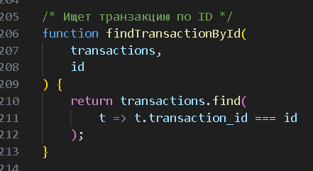

Результат:

```text
transaction_id: 2
```

---

## 14. mapTransactionDescriptions(transactions)

Возвращает массив описаний транзакций.

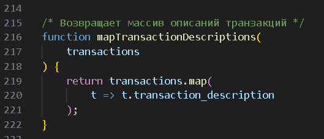

Результат:

```text
[
  'Покупка продуктов',
  'Зарплата',
  'Покупка одежды',
  'Кофе'
]
```

---

# Использованные методы JavaScript

## map()

Создает новый массив на основе существующего.

Пример:

```js
transactions.map(t => t.transaction_description)
```

---

## filter()

Фильтрует элементы массива по условию.

Пример:

```js
transactions.filter(
    t => t.transaction_type === "debit"
)
```

---

## reduce()

Вычисляет одно итоговое значение.

Пример:

```js
transactions.reduce(
    (sum, t) => sum + t.transaction_amount,
    0
)
```

---

## find()

Возвращает первый найденный элемент.

Пример:

```js
transactions.find(
    t => t.transaction_id === id
)
```

---

## Set()

Используется для хранения уникальных значений.

Пример:

```js
new Set(["debit", "credit"])
```

---

# Пример запуска программы

```bash
node main.js
```

---

# Скриншоты результата работы


---

# Контрольные вопросы

## 1. Какие методы массивов можно использовать для обработки объектов в JavaScript?

Для обработки объектов используются:

- map()
- filter()
- reduce()
- find()
- some()
- every()
- forEach()

Эти методы позволяют изменять, фильтровать, искать и анализировать данные массива.

---

## 2. Как сравнивать даты в строковом формате в JavaScript?

Для сравнения даты обычно преобразуются в объект `Date`.

Пример:

```js
new Date(date1) > new Date(date2)
```

Также можно использовать операторы:

- >
- <
- >=
- <=

---

## 3. В чем разница между map(), filter() и reduce()?

### map()

Преобразует элементы массива и возвращает новый массив.

### filter()

Отбирает только элементы, подходящие под условие.

### reduce()

Вычисляет одно итоговое значение на основе массива.

---

# Список использованных источников

1. https://developer.mozilla.org
2. https://javascript.info
3. https://nodejs.org
4. Материалы лекций

---

# Вывод

В ходе лабораторной работы были изучены:

- основы работы с массивами;
- работа с объектами;
- методы map(), filter(), reduce(), find();
- работа с датами;
- анализ данных транзакций.

Были реализованы функции для поиска, фильтрации и анализа транзакций, а также выполнено тестирование программы в консоли Node.js.